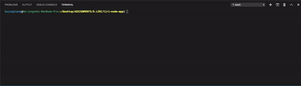

# __LIRI NODE APP__

__LIRI Node App__ is a CLI (Command-Line Interface) application that takes in command parameters to gives back data by searching through designated APIs. LIRI will search songs in Spotify, concerts in Bands in Town, and movies in OMDB.

## Application Features


#### How to Use
1. Start using LIRI Node App by downloading this repo. 
2. Run ```npm install``` to install all dependencies.
3. Type the following in your terminal or git bash:
```node liri <command> <keywords>```
4. Once you have entered the command, the search result will appear below the command you have entered. 
5. Each search will be logged into file `log.txt`.

#### Samples of Command-Line Input
- `concert-this: bruno mars` 
- `spotify-this-song: i will follow you into the dark` 
- `movie-this: pride and prejudice`
- `do-what-it-says`

#### Notes on Command-Line Input
- If you don't type in a keyword for `concert-this`, a no-result message will show.
- If you don't type in a keyword for `spotify-this-song`, the default result is 'The Sign' by Ace of Base.
- If you don't type in a keyword for `movie-this`, the default result is 'Mr. Nobody'.
- Keyword is not used in `do-what-it-says`. However, you can change the desired `<command> <keywords>` combination in file `random.txt`.

## Project Goal
Create a CLI that runs independently from a webpage using Node.js, applies modules to run desired scripts with version controls, and utilizes exisiting APIs to provide up-to-date data.

### Resources
- API: 
    - [Bands in Town](http://www.artists.bandsintown.com/bandsintown-api)
    - [Spotify](https://developer.spotify.com/dashboard/)
    - [OMDB](http://www.omdbapi.com/)
- NPM: 
    - Node-Spotify-API
    - Axios
    - Moment.js
    - DotEnv

### Notes
1. The Spotify API requires sign up in order to generate a client id and client secret for the app to run.
2. This is an ongoing project. Comments and feedbacks are appreciated!